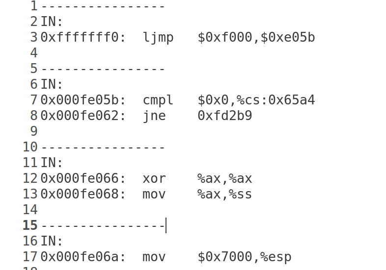

# 操作系统——实验一
-----------------------------------------
###练习一
-----------------------------------------------
####练习1.1  
>操作系统镜像文件 ucore.img 是如何一步一步生成的?(需要比较详细地解释 Makefile 中 每一条相关命令和命令参数的含义,以及说明命令导致的结果)

生成ucore.img的相关代码为下图

由图中可知为了生成ucore.img，首先需要生成bootblock、kernel
再生成一个有10000个块的文件，每个块默认512字节，用0填充
相关代码为：
>dd if=/dev/zero of=bin/ucore.img count=10000

再把bootblock中的内容写到第一个块
相关代码为：
>dd if=bin/bootblock of=bin/ucore.img conv=notrunc

之后再从第二个块开始写kernel中的内容
相关代码为：
>dd if=bin/kernel of=bin/ucore.img seek=1 conv=notrunc

####练习1.2
>一个被系统认为是符合规范的硬盘主引导扇区的特征是什么?

sign.c中相关代码如下：
```
 char buf[512];
    memset(buf, 0, sizeof(buf));
    FILE *ifp = fopen(argv[1], "rb");
    int size = fread(buf, 1, st.st_size, ifp);
    if (size != st.st_size) {
        fprintf(stderr, "read '%s' error, size is %d.\n", argv[1], size);
        return -1;
    }
    fclose(ifp);
    buf[510] = 0x55;
    buf[511] = 0xAA;
```
从sign.c的代码来看，buf字符数组代表了主引导扇区，因此一个磁盘主引导扇区有512字节。且 第510个（倒数第二个）字节是0x55， 第511个（倒数第一个）字节是0xAA。

###练习二
---------------------------------
####练习2.1
>从 CPU 加电后执行的第一条指令开始,单步跟踪 BIOS 的执行

首先将lab1/tools/gdbinit,内容修改为为:
>file obj/bootblock.o
>set architecture i8086
>target remote :1234
>continue

相关图片为：

之后在终端lab1目录下执行
>make debug

进入gdb调试界面并输入
>si

用来单步跟踪BIOS


####练习2.2
> 在初始化位置0x7c00 设置实地址断点,测试断点正常。

只需在gdbinit中间加上
```
b *0x7c00  
c              
x /2i $pc
```
就可以得到结果，如下图：

####练习2.3
>在调用qemu 时增加-d in_asm -D q.log 参数，便可以将运行的汇编指令保存在q.log 中。 将执行的汇编代码与bootasm.S 和 bootblock.asm 进行比较，看看二者是否一致。

在q.log中读取到的内容如下图所示：


其与bootasm.s 和 bootblock.asm中一样

###练习三
-------------------------------
>分析bootloader 进入保护模式的过程。

从%cs=0 $pc=0x7c00，进入后

首先清理环境：包括将flag置0和将段寄存器置0
```
	.code16
	    cli
	    cld
	    xorw %ax, %ax
	    movw %ax, %ds
	    movw %ax, %es
	    movw %ax, %ss
```
开启A20：通过将键盘控制器上的A20线置于高电位，全部32条地址线可用， 可以访问4G的内存空间。
```
	seta20.1:               # 等待8042键盘控制器不忙
	    inb $0x64, %al      # 
	    testb $0x2, %al     #
	    jnz seta20.1        #
	
	    movb $0xd1, %al     # 发送写8042输出端口的指令
	    outb %al, $0x64     #
	
	seta20.1:               # 等待8042键盘控制器不忙
	    inb $0x64, %al      # 
	    testb $0x2, %al     #
	    jnz seta20.1        #
	
	    movb $0xdf, %al     # 打开A20
	    outb %al, $0x60     # 
```
初始化GDT表：一个简单的GDT表和其描述符已经静态储存在引导区中，载入即可
```
	    lgdt gdtdesc
```
进入保护模式：通过将cr0寄存器PE位置1便开启了保护模式
```
	    movl %cr0, %eax
	    orl $CR0_PE_ON, %eax
	    movl %eax, %cr0
```
通过长跳转更新cs的基地址
```
	 ljmp $PROT_MODE_CSEG, $protcseg
	.code32
	protcseg:
```
设置段寄存器，并建立堆栈
```
	    movw $PROT_MODE_DSEG, %ax
	    movw %ax, %ds
	    movw %ax, %es
	    movw %ax, %fs
	    movw %ax, %gs
	    movw %ax, %ss
	    movl $0x0, %ebp
	    movl $start, %esp
```
转到保护模式完成，进入boot主方法

```
	    call bootmain
```
###练习四 

 -----------------------------------
 分析bootloader加载ELF格式的OS的过程。

首先看readsect函数， readsect从设备的第secno扇区读取数据到dst位置
```
	static void
	readsect(void *dst, uint32_t secno) {
	    waitdisk();
	
	    outb(0x1F2, 1);  
```                       
/设置读取扇区的数目为1
```
	    outb(0x1F3, secno & 0xFF);
	    outb(0x1F4, (secno >> 8) & 0xFF);
	    outb(0x1F5, (secno >> 16) & 0xFF);
	    outb(0x1F6, ((secno >> 24) & 0xF) | 0xE0);
```
上面四条指令联合制定了扇区号
 在这4个字节线联合构成的32位参数中
 29-31位强制设为1
28位(=0)表示访问"Disk 0"
 0-27位是28位的偏移量
 
```
	    outb(0x1F7, 0x20);           
	    waitdisk();
        insl(0x1F0, dst, SECTSIZE / 4);    
```  
     
读取到dst位置
4因为这里以DW为单位

readseg简单包装了readsect，可以从设备读取任意长度的内容。

	static void
	readseg(uintptr_t va, uint32_t count, uint32_t offset) {
	    uintptr_t end_va = va + count;
	
	    va -= offset % SECTSIZE;
	
	    uint32_t secno = (offset / SECTSIZE) + 1; 
	
	    for (; va < end_va; va += SECTSIZE, secno ++) {
	        readsect((void *)va, secno);
	    }
	}
在bootmain函数中:
```
	void
	bootmain(void) {
	    readseg((uintptr_t)ELFHDR, SECTSIZE * 8, 0);
```
 首先读取ELF的头部	
 
```	
	    if (ELFHDR->e_magic != ELF_MAGIC) {
	        goto bad;
	    }
```	
通过储存在头部的幻数判断是否是合法的ELF文件
```
	    struct proghdr *ph, *eph;
```	
	   
先将描述表的头地址存在ph

```
	    ph = (struct proghdr *)((uintptr_t)ELFHDR + ELFHDR->e_phoff);
	    eph = ph + ELFHDR->e_phnum;
```	
按照描述表将ELF文件中数据载入内存
```
	    for (; ph < eph; ph ++) {
	        readseg(ph->p_va & 0xFFFFFF, ph->p_memsz, ph->p_offset);
	    }
```
根据ELF头部储存的入口信息，找到内核的入口
```
	    ((void (*)(void))(ELFHDR->e_entry & 0xFFFFFF))();
	
	bad:
	    outw(0x8A00, 0x8A00);
	    outw(0x8A00, 0x8E00);
	    while (1);
	}

```
###练习五
>实现函数调用堆栈跟踪函数

代码如下：

实现如下效果：


####练习6.1
>中断向量表中一个表项占多少字节？其中哪几位代表中断处理代码的入口？

中断向量表一个表项占用8字节，其中2-3字节是段选择子，0-1字节和6-7字节拼成位移， 两者联合便是中断处理程序的入口地址。

####练习6.2
>请编程完善kern/trap/trap.c中对中断向量表进行初始化的函数idt_init。

代码如下：


####练习6.3
> 请编程完善trap.c中的中断处理函数trap，在对时钟中断进行处理的部分填写trap函数

代码如下：

